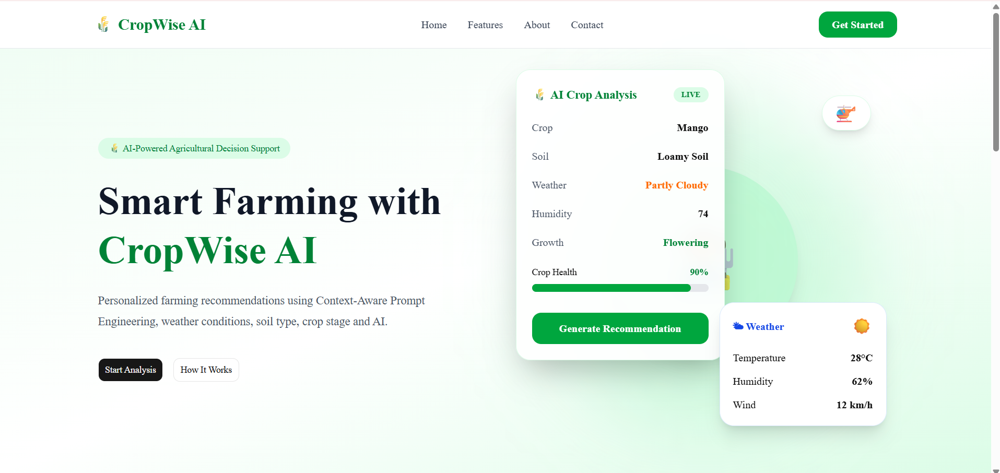
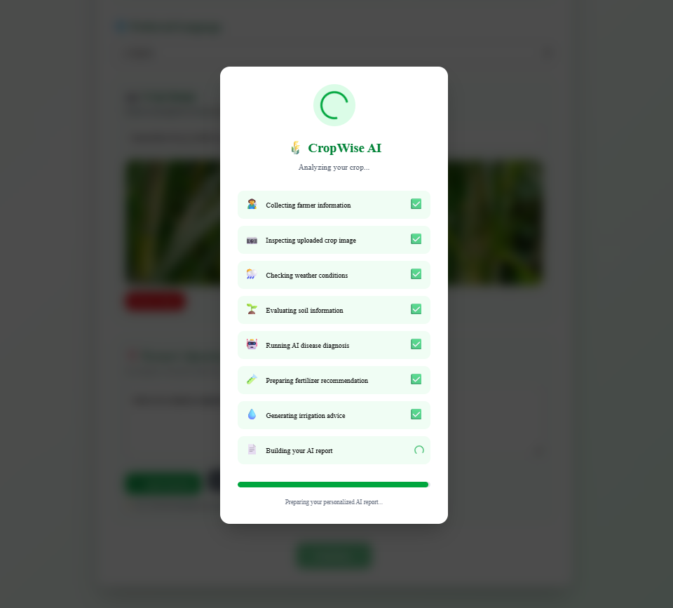
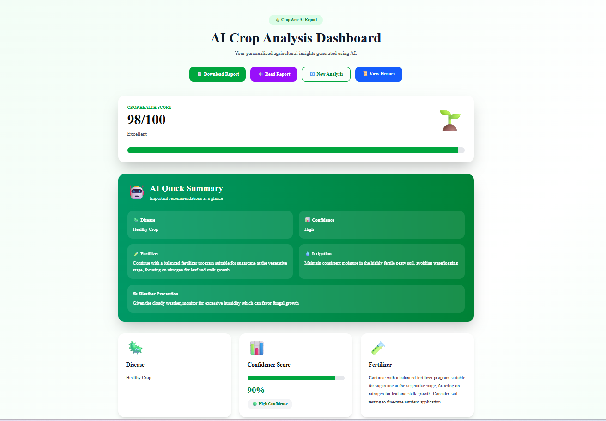
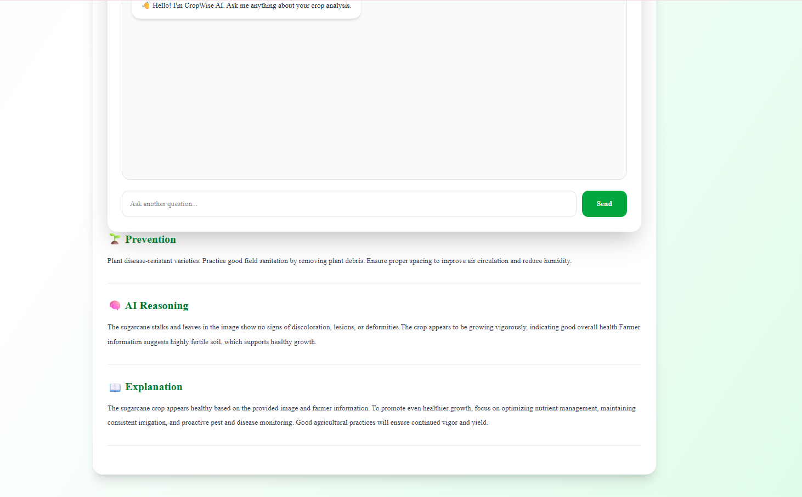
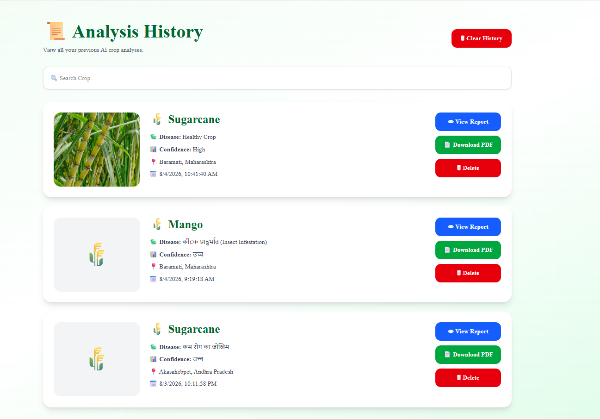

<div align="center">

# 🌾 CropWise AI
### AI-Powered Smart Farming Assistant using Context-Aware Prompt Engineering

<p>
An intelligent agricultural assistant that helps farmers diagnose crop diseases, receive fertilizer and irrigation recommendations, analyze crop images using AI, generate downloadable reports, and interact with an AI farming assistant in multiple languages.
</p>

<p>


</p>

<p>

<a href="https://crop-wise-ai-one.vercel.app">

</a>

<a href="https://github.com/Radhikakalbhor/CropWise-AI">

</a>

</p>

</div>

---

# 📖 Project Overview

CropWise AI is an AI-powered smart farming platform designed to assist farmers with intelligent crop monitoring and decision-making.

The application combines:

- 🌱 AI-powered crop disease diagnosis
- 📷 Crop image analysis
- 🌦 Weather-aware recommendations
- 🌍 Multilingual AI responses
- 🎤 Voice input
- 🔊 Voice output
- 💬 Follow-up AI conversation
- 📄 PDF report generation
- 📜 Analysis history

Unlike traditional farming applications, CropWise AI uses **Context-Aware Prompt Engineering** to combine multiple agricultural parameters before generating recommendations.

---

# ✨ Key Features

## 🤖 AI Crop Diagnosis

- AI-powered crop disease detection
- Healthy crop identification
- Disease reasoning
- Confidence scoring
- Prevention strategies

---

## 📷 Image Analysis

- Upload crop images
- AI visual inspection
- Symptom detection
- Image quality assessment
- Image-aware diagnosis

---

## 🌦 Smart Weather Integration

- Live weather information
- Temperature
- Humidity
- Weather-based precautions
- Irrigation recommendations

---

## 🌱 Soil Analysis

- Soil type selection
- Soil condition analysis
- Fertilizer recommendations
- Crop suitability

---

## 🎤 Voice Features

- Voice input using Speech Recognition
- Voice output using Speech Synthesis
- Hands-free farmer interaction

---

## 🌍 Multilingual Support

Supports AI recommendations in multiple languages including:

- English
- Hindi
- Marathi

---

## 💬 AI Follow-up Chat

After receiving a diagnosis, farmers can continue asking questions such as:

- Why is this disease occurring?
- Which fertilizer should I use?
- How often should I irrigate?
- Can weather affect my crop?
- What precautions should I take?

---

## 📄 Smart PDF Reports

Generate professional AI reports including:

- Disease diagnosis
- Confidence score
- Fertilizer recommendation
- Irrigation advice
- Weather precautions
- Prevention methods
- AI explanation

---

## 📜 Analysis History

- View previous analyses
- Search history
- Reopen reports
- Download previous reports
- Delete history

---

# 🚀 Live Demo

### 🌐 Website

https://crop-wise-ai-one.vercel.app

---

# 📂 Repository

https://github.com/Radhikakalbhor/CropWise-AI
---

# 📸 Application Screenshots

## 🏠 Home Page



The modern landing page introduces CropWise AI with a clean interface, feature highlights, and quick access to crop analysis.

---

## 🌾 Crop Analysis



The analysis page allows farmers to:

- Select crop and growth stage
- Upload crop images
- Enter soil information
- Fetch weather details
- Choose preferred language
- Ask farming-related questions

---

## 📊 AI Results Dashboard



After analysis, CropWise AI generates:

- Disease Detection
- AI Confidence Score
- Fertilizer Recommendation
- Irrigation Advice
- Pest Control
- Weather Precautions
- Prevention Measures
- AI Explanation

---

## 💬 AI Follow-up Assistant



Farmers can continue interacting with the AI after receiving the diagnosis by asking additional questions about disease management, fertilizer usage, irrigation practices, and crop care.

---

## 📜 Analysis History



Every completed analysis is saved locally, allowing users to:

- View previous reports
- Reopen analyses
- Track farming recommendations
- Access historical AI insights

---

## ⏳ AI Loading Experience


CropWise AI displays a modern loading interface while processing the crop image, weather information, and farmer inputs to generate intelligent recommendations.

---

# 🧠 AI Workflow

```text
Farmer Input
      │
      ▼
Crop Details + Image Upload
      │
      ▼
Weather API
      │
      ▼
Prompt Builder
      │
      ▼
OpenRouter API
      │
      ▼
Gemini 2.5 Flash
      │
      ▼
AI Recommendation Engine
      │
      ▼
Results Dashboard
      │
      ├── Disease Detection
      ├── Confidence Score
      ├── Fertilizer Advice
      ├── Irrigation
      ├── Pest Control
      ├── Weather Precautions
      ├── PDF Report
      └── Follow-up AI Chat
```

---
# 🛠️ Tech Stack

| Category | Technologies |
|----------|--------------|
| Frontend | Next.js 15, React, TypeScript |
| Styling | Tailwind CSS |
| AI Model | Google Gemini 2.5 Flash (via OpenRouter) |
| AI Platform | OpenRouter API |
| Weather API | WeatherAPI |
| PDF Generation | jsPDF |
| Voice Input | Web Speech API |
| Voice Output | Speech Synthesis API |
| Deployment | Vercel |
| Version Control | Git & GitHub |

---

# 📂 Project Structure

```text
CropWise-AI/
│
├── app/
│   ├── analyze/
│   ├── api/
│   ├── history/
│   ├── results/
│   ├── globals.css
│   ├── layout.tsx
│   └── page.tsx
│
├── assets/
│   └── screenshots/
│
├── components/
│   ├── analyze/
│   ├── home/
│   ├── layout/
│   ├── results/
│   └── ui/
│
├── context/
│
├── hooks/
│
├── lib/
│   ├── ai.ts
│   ├── history.ts
│   ├── pdf.ts
│   └── promptBuilder.ts
│
├── data/
│
├── public/
│   └── images/
│
├── types/
│
├── README.md
├── package.json
└── tsconfig.json
```

---

# 🚀 Installation

Clone the repository

```bash
git clone https://github.com/Radhikakalbhor/CropWise-AI.git
```

Go into the project

```bash
cd CropWise-AI
```

Install dependencies

```bash
npm install
```

Create a `.env.local` file in the project root.

Add the following environment variables:

```env
OPENROUTER_API_KEY=your_openrouter_api_key
WEATHER_API_KEY=your_weather_api_key
```

Start the development server

```bash
npm run dev
```

Open your browser and visit:

```text
http://localhost:3000
```

---

# 🔑 Environment Variables

| Variable | Description |
|----------|-------------|
| OPENROUTER_API_KEY | API key used for AI crop analysis |
| WEATHER_API_KEY | API key used to fetch live weather information |

---

# ⚙️ Core Functionalities

- AI-powered crop disease diagnosis
- Image-based crop analysis
- Live weather integration
- Soil-aware recommendations
- Fertilizer suggestions
- Irrigation recommendations
- Pest control guidance
- Prevention strategies
- Confidence score generation
- Multilingual AI responses
- Voice input
- Voice output
- AI follow-up chat
- PDF report generation
- Analysis history
- Responsive user interface

---

# 🏗️ System Architecture

```text
Farmer
   │
   ▼
Next.js Frontend
   │
   ├────────────► Weather API
   │
   ▼
Prompt Builder
   │
   ▼
OpenRouter API
   │
   ▼
Google Gemini 2.5 Flash
   │
   ▼
AI Response
   │
   ▼
Results Dashboard
   │
   ├── PDF Report
   ├── Voice Output
   ├── AI Chat
   └── History
```

---
# 🌟 Project Highlights

CropWise AI is more than a crop disease detection system. It is a complete AI-powered farming assistant that combines multiple technologies to help farmers make informed agricultural decisions.

### Key Highlights

- 🤖 AI-powered crop disease diagnosis
- 📷 Image-based crop analysis
- 🌦️ Live weather integration
- 🌱 Soil-aware fertilizer recommendations
- 💧 Intelligent irrigation suggestions
- 🛡️ Pest control recommendations
- 🌍 Multilingual AI responses
- 🎤 Voice input support
- 🔊 Voice output support
- 💬 AI follow-up conversation
- 📄 Downloadable PDF reports
- 📜 Analysis history
- ☁️ Cloud deployment using Vercel
- 📱 Responsive UI for desktop and mobile

---

# 🎯 Future Enhancements

The following features can be added in future versions:

- 📍 GPS-based automatic location detection
- 🛰️ Satellite crop monitoring
- 📈 Crop yield prediction using Machine Learning
- 🌾 Fertilizer cost optimization
- 🦗 Real-time pest detection using computer vision
- ☁️ Cloud database for permanent report storage
- 👨‍🌾 Farmer community discussion forum
- 📊 Analytics dashboard for agricultural insights
- 📱 Android and iOS mobile application
- 🔔 Weather alert notifications

---

# 💡 Challenges Solved

During the development of CropWise AI, the following technical challenges were addressed:

- AI JSON parsing and validation
- Image upload with AI analysis
- Context-aware prompt engineering
- Weather API integration
- Speech recognition and speech synthesis
- PDF generation
- AI follow-up conversation
- Multilingual AI responses
- Deployment using Vercel
- GitHub version control and CI/CD workflow

---

# 📈 Learning Outcomes

This project helped strengthen practical knowledge in:

- Prompt Engineering
- Generative AI Integration
- Next.js Development
- React & TypeScript
- Tailwind CSS
- REST APIs
- AI-powered Web Applications
- Git & GitHub
- Vercel Deployment
- Full-Stack Application Development

---

# 👩‍💻 Author

**Radhika Kalbhor**

Engineering Student | AI & Full-Stack Developer

GitHub:
https://github.com/Radhikakalbhor

Project Repository:
https://github.com/Radhikakalbhor/CropWise-AI

Live Demo:
https://crop-wise-ai-one.vercel.app

---

# 🤝 Contributing

Contributions, suggestions, and improvements are welcome.

If you'd like to improve CropWise AI:

1. Fork the repository
2. Create a feature branch
3. Commit your changes
4. Push your branch
5. Open a Pull Request

---

# 📄 License

This project is intended for educational and portfolio purposes.

---

# ⭐ Support

If you found this project helpful:

⭐ Star this repository

🍴 Fork the repository

📢 Share it with others

---

<div align="center">

## 🌾 Empowering Farmers with Artificial Intelligence 🌾

**Made with ❤️ using Next.js, TypeScript, Tailwind CSS, OpenRouter & Gemini AI**

</div>